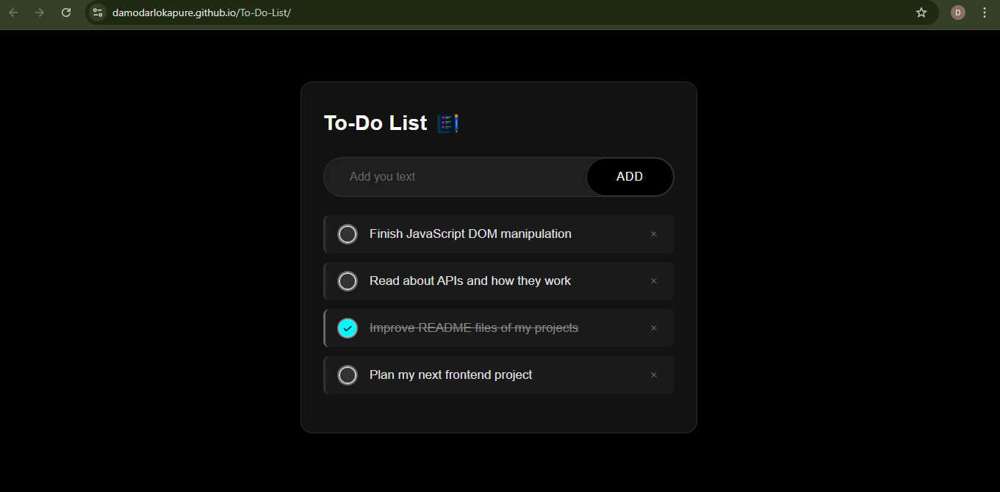

# 📝 To-Do List App

A simple and responsive To-Do List built with HTML, CSS, and JavaScript.

---

## 🚀 Features
- Add new tasks dynamically
- Mark tasks as complete/incomplete
- Delete tasks individually
- Clean and responsive user interface
- Keyboard accessible and user-friendly

---

## 📸 Screenshot

---

## 🔗 Live Demo

[Click here to view live demo](https://damodarlokapure.github.io/To-Do-List/)

---

## 📁 Technologies Used
- HTML5
- CSS3
- Vanilla JavaScript (ES6+)

---

## 📦 Setup

To run the project locally:

1. Clone the repo or download the ZIP  
2. Open `index.html` in your favorite browser  
3. Start managing your tasks!

---

## ✍️ Author

[Damodar Lokapure](https://github.com/damodarlokapure)

---

## 🙌 Contributions & Feedback

Feel free to open issues or submit pull requests to improve this app!

---

